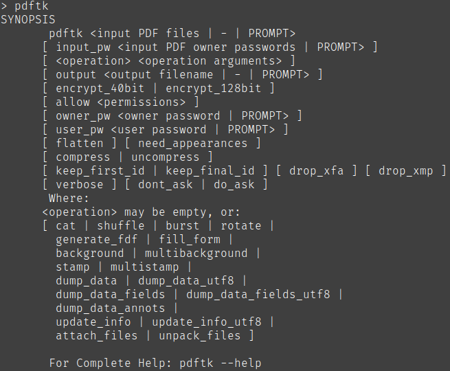

# pdfmerge

This tool is used to merge separate front-side and back-side scans as pdf
into a complete pdf file.

Small example:

Your front scan has the pages F1, F2, F3. Your back has the pages B1, B2, B3.
This tool creates a PDF which looks like F1, B1, F2, B2, F3, B3.


## Prerequisite

You need to have pdftk installed. Furthermore *pdftk* must be registered in your *$PATH* system-variable.
You can test if pdftk is installed correctly when you open your terminal, type `pdftk` and press return.

You can see an example below:




## Usage

**Hint:** This application checks if the files are existing and if the number of pages is matching.
Due to the normal circumstances of separate front- and back-scans it's assumed that the number of pages differ by 0 or 1 (max). If there is a difference only the back-scans may have one page less than the front-scans.

Ensure that you have pdftk installed and you downloaded the correct pdfmerge for your system. The syntax to use this merge tool is the following:

```sh
$ pdfmerge [front] [back] [output]
```

So if you call `pdfmerge` with the following command

```sh
pdfmerge front-scan.pdf back-scan.pdf result.pdf
```

both PDF-files *front-scan* and *back-scan* will be merged (as described above) into *result.pdf*.
If you have already a file called result.pdf it will be overwritten by pdftk.

## License

See LICENSE in this repository for details.


---

## External links

PDFtk: https://www.pdflabs.com/tools/pdftk-the-pdf-toolkit/
